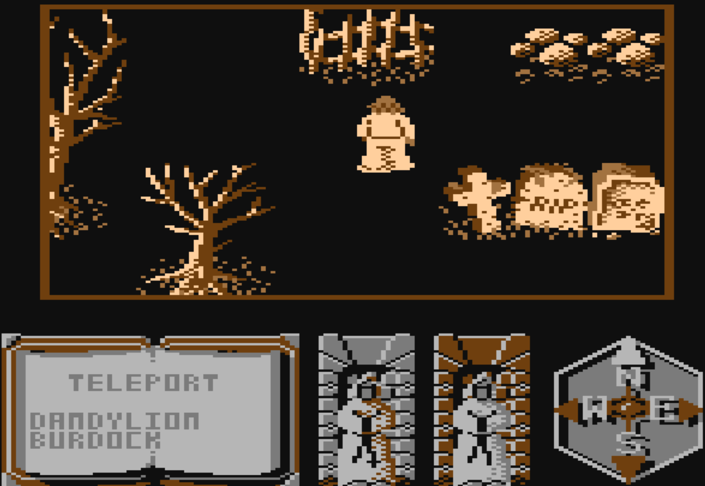

# Feud game patch
This game is interesting but it's almost impossible to enjoy it without "hacking"
1) It's 2 against 1 (the enemy has a patsy!)
2) Your enemy recovers almost immediately and infinite number of times
3) Atari version has a blatant bug preventing Player from picking one of the (most) important plants

## The patches
For every platform there are two patches: 
1) giving Player full invincibility
2) preventing the enemy from self-healing (that should even the odds just a bit!)

The invincibility patch also includes preventing enemy from self-healing.\
For Atari there is also 3rd patch, it just fixes the game's bug, now Player can finally pick that plant!
